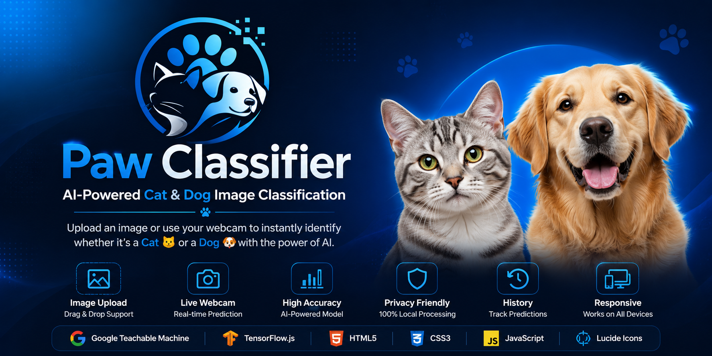
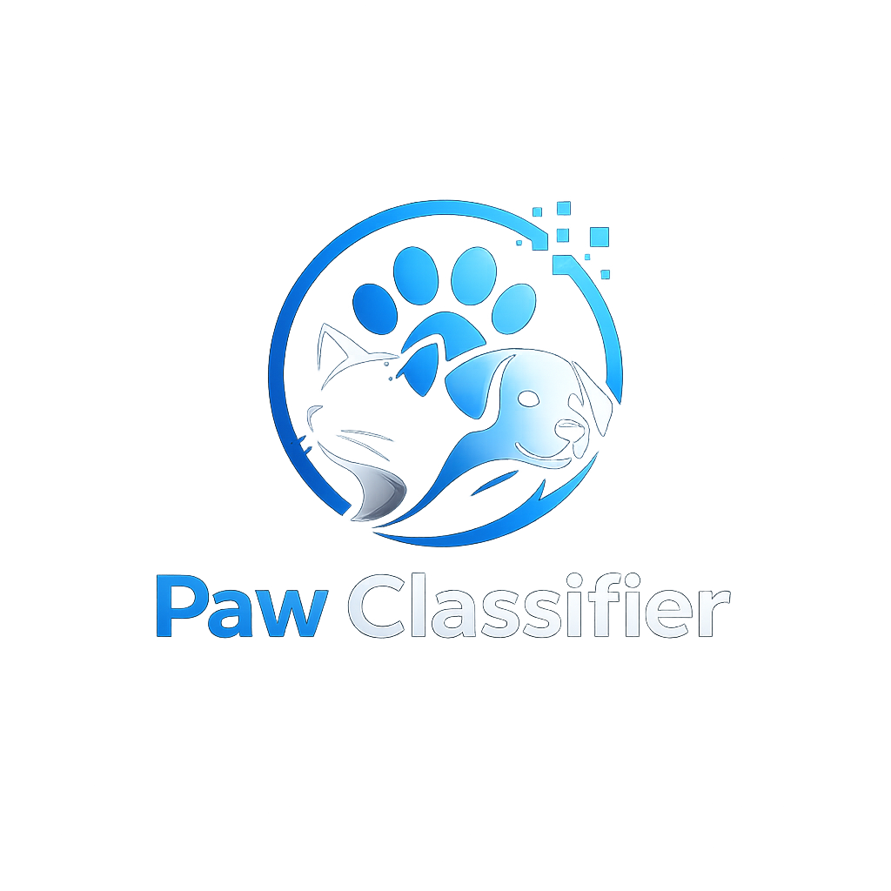

<div align="center">





# 🐾 Paw Classifier

### AI-powered Cat & Dog Image Classification

A lightweight AI-powered web application that classifies **Cats** 🐱 and **Dogs** 🐶 using a custom machine learning model trained with **Google Teachable Machine** and powered by **TensorFlow.js**.

<p>
    
    
    
    
    
    
</p>

<p>
<a href="https://mkishoredev.github.io/paw-classifier/" target="_blank">

</a>

<a href="https://github.com/mkishoredev/paw-classifier">

</a>
</p>

</div>

---

# ✨ About

**Paw Classifier** is a browser-based AI application capable of identifying whether an uploaded image contains a **Cat** or a **Dog**.

The machine learning model was trained using **Google Teachable Machine** and exported as a **TensorFlow.js** model, allowing all predictions to run directly inside the user's browser without sending images to any server.

Originally developed for the **Class 12 Artificial Intelligence Practical – Activity 3.2: Creating a Website Containing an ML Model**, the project was expanded with a polished, responsive interface and modern user experience suitable for showcasing on GitHub.

---

# 🌐 Live Demo

🚀 **Website:** https://mkishoredev.github.io/paw-classifier/

Experience Paw Classifier directly in your browser without installing anything. Simply upload a cat or dog image, or use your webcam to get an instant AI-powered prediction.

---

# ✨ Features

- 🐱 AI-powered Cat & Dog classification
- 📤 Drag & Drop image upload
- 🖼️ Image preview
- 📸 Live webcam prediction
- 🔄 Camera switching support
- 📊 Animated confidence display
- 📜 Prediction history
- 🔔 Toast notifications
- ⚡ Instant browser-based predictions
- 📱 Responsive on desktop, tablet and mobile
- 🔒 Privacy-friendly (images never leave your device)

---

# 🛠 Tech Stack

- HTML5
- CSS3
- Vanilla JavaScript (ES6)
- TensorFlow.js
- Google Teachable Machine
- Lucide Icons

---

# 📂 Project Structure

```text
paw-classifier/
│
├── assets/
│   ├── banner.png
│   └── logo.png
│
├── index.html
├── style.css
├── script.js
├── dataset_downloader.py
├── LICENSE
└── README.md
```

---

# 🧠 Model Training

The AI model was trained using **Google Teachable Machine**.

Training workflow:

1. Collect Cat and Dog images.
2. Upload images to Google Teachable Machine.
3. Train the image classification model.
4. Export the TensorFlow.js model.
5. Integrate the exported model into the website.
6. Deploy using GitHub Pages.

---

# 📦 Dataset

The training dataset consists of two image classes:

- 🐱 Cats
- 🐶 Dogs

Each class contains approximately **100 high-quality images**.

Images were collected using the **Pixabay API**.

The included **dataset_downloader.py** script automates dataset creation by:

- Downloading images
- Removing duplicate images
- Filtering out low-resolution images
- Organizing images into folders
- Preparing the dataset for Google Teachable Machine

---

# 🚀 Getting Started

Clone the repository.

```bash
git clone https://github.com/mkishoredev/paw-classifier.git
```

Navigate into the project.

```bash
cd paw-classifier
```

Run a local server.

Using Python:

```bash
python -m http.server
```

Or simply use **Live Server** inside Visual Studio Code.

---

# 🧠 How It Works

1. The TensorFlow.js model loads when the website starts.
2. Users upload an image or open their webcam.
3. The AI analyzes the image.
4. The highest-confidence prediction is displayed.
5. Confidence scores are visualized with smooth animations.

Everything happens locally inside the browser.

---

# 🔒 Privacy

Paw Classifier performs all inference locally.

- ✅ No backend
- ✅ No cloud processing
- ✅ No user accounts
- ✅ No image uploads
- ✅ Images remain on your device

---

# 📸 Screenshots

<div align="center">
  <a href="https://mkishoredev.github.io/paw-classifier/" target="_blank">
    
  </a>
  <p><i>Live web preview automatically generated via API</i></p>
</div>

---

# 🎓 Educational Purpose

This project was created as part of:

**Class 12 Artificial Intelligence Practical**

**Activity 3.2 — Creating a Website Containing an ML Model**

Learning objectives demonstrated:

- Image dataset collection
- Machine learning model training
- TensorFlow.js deployment
- Browser-based AI inference
- Interactive web development
- Responsive UI design

---

# ❤️ Acknowledgements

Special thanks to:

- Google Teachable Machine
- TensorFlow.js
- Pixabay
- Lucide Icons

for providing the tools and resources that made this project possible.

---

# 📄 License

This project is licensed under the **MIT License**.

See the **LICENSE** file for details.

---

# 👨‍💻 Author

<div align="center">

## M Kishore

Student • Developer • AI Enthusiast

<a href="https://github.com/mkishoredev">

</a>

</div>

---

<div align="center">

⭐ If you enjoyed this project, consider starring the repository.

Made with ❤️ by <b>M Kishore</b>

</div>
